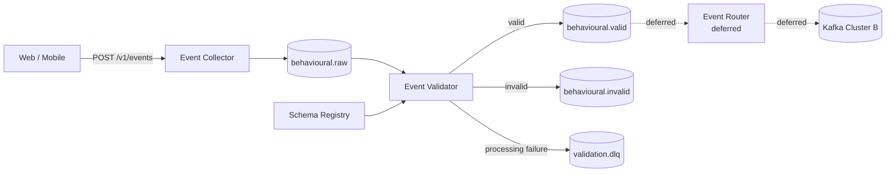

# Behavioural Event Platform

[](https://github.com/mbelekar/behavioural-event-platform/actions/workflows/tests.yml)

A Java/Spring Boot platform that accepts behavioural events, validates them against contracts in Schema Registry, and publishes a trusted stream to Kafka.

The main idea is simple: producers can send events without being coupled to downstream validation, while consumers get a stream they can trust.

## Status

HTTP ingestion and asynchronous schema validation are implemented.

| Component | Status |
| --- | --- |
| Event Collector | ✅ Implemented |
| Schema Registry integration | ✅ Implemented |
| Event Validator | ✅ Implemented |
| Valid / invalid event streams | ✅ Implemented |
| Dead-letter topic (`validation.dlq`) | ✅ Implemented |
| Business validation | ✅ Implemented |
| Cross-cluster Event Router | ⏸️ Deferred |
| Observability (metrics, tracing, dashboards) | ⏸️ Deferred until productionisation |

See [`docs/Design.md`](docs/Design.md) for the full design.

## Why this exists

Behavioural events arriving from web and mobile clients may be malformed, outdated or incompatible with the expected contract.

Making every downstream consumer defend against those problems duplicates validation logic and makes it difficult to know which data can be trusted.

This platform creates a clear boundary:

```text
behavioural.raw
      ↓
  validation
      ↓
behavioural.valid
```

Anything on `behavioural.valid` conforms to a registered schema and passes the platform's business rules.

Invalid producer data goes to `behavioural.invalid`. Infrastructure failures are retried rather than being mistaken for bad data. Events that can't be processed go to `validation.dlq`.

## Architecture



The collector writes to Kafka before acknowledging the request. Validation then happens asynchronously.

Schema Registry holds versioned JSON Schema contracts for each event type and enforces compatibility as those contracts evolve.

## Run locally

Requirements:

- Docker
- JDK 17+

Build the services:

```bash
./auto/build
```

Start Kafka, Schema Registry and the topics, and register the event schemas:

```bash
./auto/live-up
```

Run the collector and validator, each in its own terminal:

```bash
./auto/run collector
./auto/run validator
```

Stop everything and remove its data:

```bash
./auto/live-down
```

## Try it

Send a valid event:

```bash
curl -X POST localhost:8080/v1/events \
  -H 'Content-Type: application/json' \
  -d '{
    "eventId": "demo-1",
    "eventType": "product_viewed",
    "schemaVersion": 2,
    "occurredAt": "'"$(date -u +%Y-%m-%dT%H:%M:%SZ)"'",
    "source": "web",
    "userId": "user-123",
    "payload": {
      "productId": "SKU-981",
      "recommendationSource": "home"
    }
  }'
```

The request returns `202 Accepted`.

The event flows asynchronously through:

```text
HTTP
  → behavioural.raw
  → Event Validator
  → behavioural.valid
```

An event that does not conform to its registered schema, or fails a business rule, is instead published to `behavioural.invalid` with structured validation errors.

### Inspect and replay the DLQ

Events the validator can't process are copied unchanged to `validation.dlq`.

Inspect them:

```bash
docker exec kafka-a /opt/kafka/bin/kafka-console-consumer.sh --bootstrap-server localhost:9092 \
  --topic validation.dlq --from-beginning --timeout-ms 10000 \
  --formatter-property print.key=true --formatter-property print.headers=true
```

Once the cause is fixed, replay them to `behavioural.raw`:

```bash
docker exec kafka-a sh -c '/opt/kafka/bin/kafka-console-consumer.sh --bootstrap-server localhost:9092 \
    --topic validation.dlq --from-beginning --timeout-ms 10000 \
    --formatter-property print.key=true --formatter-property key.separator="|" > /tmp/dlq.txt \
  && /opt/kafka/bin/kafka-console-producer.sh --bootstrap-server localhost:9092 \
    --topic behavioural.raw --reader-property parse.key=true --reader-property key.separator="|" < /tmp/dlq.txt'
```

This replays every DLQ record and suits JSON events only. The file stops records that fail again from looping.

## Testing

The project uses Testcontainers to test against real Kafka and Schema Registry instances rather than mocking the infrastructure.

```bash
./auto/test
```

The build also fails on unformatted Java code; `./auto/format` fixes it (palantir-java-format).

JaCoCo coverage reports are written to `<module>/build/reports/jacoco/test/html/index.html`; CI uploads them as the `coverage` artifact.

CI runs the same command on every push to `main` and every pull request. The tests cover ingestion, schema registration and evolution, valid and invalid events, and dependency failure behaviour.

## Project structure

```text
event-collector/       HTTP → behavioural.raw
event-validator/       raw → schema validation → valid / invalid
event-contracts/       event models and JSON Schemas
schema-registration/   Schema Registry registration
integration-tests/     pipeline tests running the service jars
docs/                  design, specs and architecture decisions
docker-compose.yml     local Kafka, Schema Registry and topics
auto/                  build, test, run and local-infrastructure scripts
.github/workflows/     CI
```

## Documentation

- [`Design.md`](docs/Design.md) — architecture and system behaviour
- [`docs/decisions`](docs/decisions/) — significant architecture decisions

## License

Licensed under the [Apache License, Version 2.0](LICENSE).
