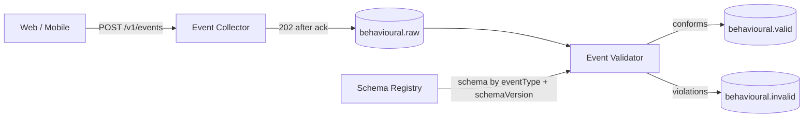

# Behavioural Event Platform

A Java/Spring Boot platform that ingests behavioural events from web and mobile applications, validates them against contracts held in Schema Registry, and publishes a trusted stream of events on Kafka.

It is designed so that **consumers can trust what they read**, and so that **bad data and broken infrastructure never get confused**.

> **Current scope:** HTTP ingestion and asynchronous schema validation. Business rules, the processing dead-letter queue, cross-cluster routing and observability are not built yet (see [Roadmap](#roadmap)).

## What it does

- Accepts events over HTTP and writes them to a durable Kafka topic (`behavioural.raw`) before acknowledging
- Validates every event asynchronously against JSON Schemas registered in Confluent Schema Registry
- Publishes valid events to a trusted topic (`behavioural.valid`) in Schema Registry wire format, so consumers can look up the exact schema
- Quarantines invalid events on `behavioural.invalid` with structured, field-level errors
- Enforces schema compatibility (`BACKWARD`) when schemas are registered, before any service sees them
- Preserves per-user ordering by keying every record on `userId` (or `sessionId`)
- Holds events, rather than losing or misclassifying them, while Schema Registry or Kafka is unavailable

## Why this exists

Client applications send events that may be malformed, outdated or simply wrong, and downstream consumers shouldn't each have to defend against that.

This platform draws a **trust boundary**: anything on `behavioural.valid` conforms to a registered schema, whatever the producer sent. It also keeps two kinds of failure apart:

| Situation | Where the event goes |
|---|---|
| The event is wrong (unknown type, missing field, wrong type) | `behavioural.invalid`, with errors explaining why |
| The platform couldn't check it (Schema Registry or Kafka down) | Nowhere yet: it is retried until the dependency recovers |

Ingestion is decoupled from validation. If the validator or Schema Registry is down, clients still get `202 Accepted` and events wait safely in Kafka.

## Current capabilities

The project is at **Phase 2 of 6** ([build roadmap](docs/Design.md#25-build-roadmap)).

| Capability | Status | Details |
| --- | --- | --- |
| HTTP ingestion (`POST /v1/events`) | ✅ Implemented | [ADR 0004](docs/decisions/0004-use-kafka-as-durable-ingestion-boundary.md) |
| Durable raw topic, `202` only after the broker acknowledges | ✅ Implemented | [ADR 0004](docs/decisions/0004-use-kafka-as-durable-ingestion-boundary.md) |
| Client-supplied event IDs for deduplication | ✅ Implemented | [ADR 0002](docs/decisions/0002-use-event-id-for-idempotency.md) |
| Per-user ordering via partition keys | ✅ Implemented | [ADR 0003](docs/decisions/0003-preserve-user-ordering-with-partition-keys.md) |
| JSON Schema contracts, one subject per event type | ✅ Implemented | [ADR 0005](docs/decisions/0005-use-json-schema-subjects-per-event-type.md) |
| Ordered schema registration with compatibility checks | ✅ Implemented | [ADR 0006](docs/decisions/0006-register-schemas-in-a-separate-step.md) |
| Trusted topic in Schema Registry wire format | ✅ Implemented | [ADR 0007](docs/decisions/0007-publish-trusted-events-in-schema-registry-wire-format.md) |
| Invalid events quarantined with structured errors | ✅ Implemented | [ADR 0008](docs/decisions/0008-separate-invalid-events-from-infrastructure-failures.md) |
| No event loss while Schema Registry or Kafka is down | ✅ Implemented (interim: unbounded retry) | [ADR 0008](docs/decisions/0008-separate-invalid-events-from-infrastructure-failures.md) |
| Business validation rules | 📋 Planned (Phase 3) | [Design §7.2](docs/Design.md#72-business-validation) |
| Bounded retries and `validation.dlq` | 📋 Planned (Phase 3) | [Design §15–16](docs/Design.md#15-retry-strategy) |
| Cross-cluster routing | 📋 Planned (Phase 4) | [Design §12–13](docs/Design.md#12-event-router) |
| Metrics, tracing and structured logs | 📋 Planned (Phase 6) | [Design §18](docs/Design.md#18-observability) |

## How it works



### Kafka is the ingestion boundary

The collector does only basic shape checks, adds platform metadata (`correlationId`, `receivedAt`) and writes to `behavioural.raw`. It never talks to Schema Registry. A `202` means the event is durably stored, and a `503` means the client should retry with the same `eventId`. See [ADR 0004](docs/decisions/0004-use-kafka-as-durable-ingestion-boundary.md).

### Contracts are enforced by Schema Registry

Each event type has its own subject (`product_viewed`, `purchase_completed`, …) whose versions match the event's `schemaVersion`. Every type schema combines a shared envelope schema with its own `payload`. The validator looks up the exact schema, validates the whole event, and republishes the producer's original JSON with a 5-byte prefix identifying that schema.

```text
event-contracts/schemas/
├── behavioural_envelope/v1.json
├── product_viewed/v1.json
├── product_viewed/v2.json      # adds optional recommendationSource (BACKWARD compatible)
└── ...
```

See [ADR 0005](docs/decisions/0005-use-json-schema-subjects-per-event-type.md), [ADR 0006](docs/decisions/0006-register-schemas-in-a-separate-step.md) and [ADR 0007](docs/decisions/0007-publish-trusted-events-in-schema-registry-wire-format.md).

## Quick start

### Requirements

- Docker (Engine 25+)
- A JDK 17+ to run Gradle. The build downloads JDK 21 automatically via Gradle toolchains.

### Build

```bash
./gradlew build
```

Runs all unit and Testcontainers tests. Docker must be running.

### Start the infrastructure

```bash
docker compose up -d --wait                       # Kafka Cluster A, Schema Registry, topics
./gradlew :schema-registration:registerSchemas    # register event-contracts/schemas
```

Registration is safe to re-run. It fails if a schema is incompatible, or if a file's version doesn't match the version the registry assigns.

### Run the services

In two terminals:

```bash
./gradlew :event-collector:bootRun    # http://localhost:8080
./gradlew :event-validator:bootRun    # behavioural.raw → behavioural.valid / behavioural.invalid
```

### Send an event

A valid event:

```bash
curl -i -X POST localhost:8080/v1/events -H 'Content-Type: application/json' \
  -d '{"eventId":"demo-1","eventType":"product_viewed","schemaVersion":2,"occurredAt":"2026-09-27T01:23:31Z","source":"web","userId":"user-123","payload":{"productId":"SKU-981","recommendationSource":"home"}}'
```

One the validator will reject (no `productId`):

```bash
curl -i -X POST localhost:8080/v1/events -H 'Content-Type: application/json' \
  -d '{"eventId":"demo-2","eventType":"product_viewed","schemaVersion":2,"occurredAt":"2026-09-27T01:23:31Z","source":"web","userId":"user-123","payload":{"category":"laptops"}}'
```

Both return `202 Accepted`: validation happens after ingestion.

### Read the results

```bash
docker compose exec kafka-a /opt/kafka/bin/kafka-console-consumer.sh --bootstrap-server localhost:9092 \
  --topic behavioural.valid --from-beginning --formatter-property print.key=true

docker compose exec kafka-a /opt/kafka/bin/kafka-console-consumer.sh --bootstrap-server localhost:9092 \
  --topic behavioural.invalid --from-beginning --formatter-property print.key=true
```

Records on `behavioural.valid` start with 5 unprintable bytes: the Schema Registry magic byte and schema ID. Records on `behavioural.invalid` are JSON:

```json
{
  "event": { "eventId": "demo-2", "...": "..." },
  "validationErrors": [
    { "code": "REQUIRED_FIELD_MISSING", "field": "payload.productId", "message": "required key [productId] not found" }
  ],
  "validatedAt": "2026-09-27T04:42:34.866869Z"
}
```

## Testing

The project favours tests against real Kafka and Schema Registry (Testcontainers) over mocks.

| Layer | What it verifies | Docker required? |
| --- | --- | --- |
| Unit tests | Request checks, metadata, partition keys, error mapping, wire format | No |
| Schema tests | Every schema accepts collector-shaped examples and rejects bad ones | No |
| Schema Registry tests | Ordered registration, re-runs, compatibility rejections, version mismatches | Yes |
| Validator tests | Schema lookup, the 12 validation scenarios, publishing to valid / invalid | Yes |
| Outage test | A paused Schema Registry holds the event (never marks it invalid) and delivers it after recovery | Yes |
| Collector end-to-end | HTTP → `behavioural.raw` with the expected key and metadata | Yes |

```bash
./gradlew build                        # everything: 74 tests
./gradlew :event-validator:test        # one module
```

## Project structure

```text
docker-compose.yml               # local Kafka Cluster A, Schema Registry, topics
event-contracts/
├── schemas/                     # JSON Schemas: <subject>/v<N>.json
└── src/                         # shared BehaviouralEvent envelope record
event-collector/                 # POST /v1/events → behavioural.raw
schema-registration/
├── src/main/                    # ordered registration + registerSchemas task
└── src/testFixtures/            # shared Kafka + Schema Registry test containers
event-validator/                 # behavioural.raw → behavioural.valid / behavioural.invalid
docs/
├── Design.md                    # full platform design
└── decisions/                   # architecture decision records
```

## Roadmap

| Phase | Outcome | Status |
| --- | --- | --- |
| 1 | HTTP ingestion to `behavioural.raw` | ✅ Done |
| 2 | Schema validation with Schema Registry; `behavioural.valid` / `behavioural.invalid` | 🚧 In progress |
| 3 | Business validation, bounded retries, `validation.dlq` | 📋 Planned |
| 4 | Event Router to a second Kafka cluster | 📋 Planned |
| 5 | Reliability hardening and failure-injection tests | 📋 Planned |
| 6 | Metrics, consumer lag, structured logging, OpenTelemetry tracing | 📋 Planned |

## Documentation

- [Design](docs/Design.md)
- [Architecture decisions](docs/decisions/)
