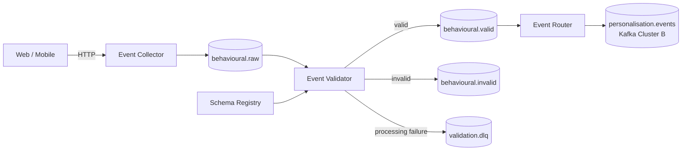

# Behavioural Event Platform: Design

## Overview

The Behavioural Event Platform accepts behavioural events from web and mobile applications, validates them against contracts in Schema Registry, and publishes trusted events to Kafka.

The design separates ingestion from validation so producers are not coupled to Schema Registry or downstream consumers.

**In scope**

- HTTP event ingestion
- Durable raw events in Kafka
- Schema validation and evolution
- Trusted and invalid event streams
- Business validation
- Cross-cluster routing for selected events
- Retry and dead-letter handling
- Integration testing against real Kafka infrastructure

**Out of scope**

- Stream processing with Flink or Kafka Streams
- Analytics and long-term storage
- Identity resolution
- Exactly-once processing across Kafka clusters

## Architecture



Kafka Cluster A contains the ingestion and validation pipeline. Selected validated events can later be routed to Kafka Cluster B.

## Event model

All events share an envelope:

```json
{
  "eventId": "demo-1",
  "eventType": "product_viewed",
  "schemaVersion": 2,
  "occurredAt": "2026-09-27T01:23:31Z",
  "source": "web",
  "userId": "user-123",
  "sessionId": "session-456",
  "payload": {
    "productId": "SKU-981"
  }
}
```

`payload` is defined by the event-specific schema.

`eventId` is supplied by the producer and remains unchanged throughout the pipeline. Kafka records are keyed by `userId`, falling back to `sessionId`, to preserve ordering for a user or session.

## Ingestion

The Event Collector exposes:

```text
POST /v1/events
```

It performs only the checks needed to safely accept the request, adds platform metadata, and publishes the event to `behavioural.raw`.

The collector does not call Schema Registry.

A `202 Accepted` means Kafka has acknowledged the event. Validation happens asynchronously.

This keeps ingestion available when the validator or Schema Registry is temporarily unavailable.

## Validation

The Event Validator consumes `behavioural.raw`.

It looks up the schema identified by:

```text
eventType + schemaVersion
```

and validates the complete event.

Valid events are published to:

```text
behavioural.valid
```

Invalid events are published to:

```text
behavioural.invalid
```

with structured validation errors.

`behavioural.valid` is the trust boundary of the platform. Downstream consumers can assume that events on this topic conform to a registered contract.

Business validation can run after schema validation for rules that cannot be expressed cleanly in the schema.

## Schema evolution

Each event type has its own Schema Registry subject and can evolve independently.

For example:

```text
product_viewed v1
    productId
    category

product_viewed v2
    productId
    category
    recommendationSource?
```

Schema Registry enforces backward compatibility when new versions are registered.

The platform supports multiple schema versions so producers do not need to upgrade at the same time.

## Failure handling

Bad data and infrastructure failures are different problems.

| Situation | Behaviour |
| --- | --- |
| Event does not match its schema | Publish to `behavioural.invalid` |
| Business validation fails | Publish to `behavioural.invalid` |
| Schema Registry temporarily unavailable | Retry |
| Kafka temporarily unavailable | Retry |
| Processing repeatedly fails | Publish to `validation.dlq` |
| Validator unavailable | Event remains in `behavioural.raw` |

An unavailable dependency must not cause an event to be classified as invalid.

## Cross-cluster routing

A later Event Router consumes `behavioural.valid` and forwards selected event types to Kafka Cluster B.

For example:

```text
product_viewed
checkout_started
purchase_completed
        ↓
personalisation.events
```

The router uses separate Kafka consumer and producer configurations for the two clusters.

Cross-cluster delivery is at least once. The platform does not attempt distributed exactly-once processing between independent Kafka clusters.

Consumers can use the stable `eventId` when deduplication is required.

## Testing

The project favours integration tests against real Kafka and Schema Registry instances using Testcontainers.

The main scenarios are:

```text
HTTP → behavioural.raw

behavioural.raw → validator → behavioural.valid

behavioural.raw → validator → behavioural.invalid

behavioural.valid → router → Kafka Cluster B
```

Tests also cover schema evolution and dependency failures.

Unit tests are used for deterministic validation and routing logic.

## Design principles

**Kafka is the durable ingestion boundary.** Once Kafka acknowledges an event, downstream processing can happen asynchronously.

**Raw events represent what the producer sent.** Validation creates new trusted or invalid streams rather than changing the raw event.

**Validation creates a trust boundary.** Consumers of `behavioural.valid` should not repeat contract validation.

**Bad data is not an infrastructure failure.** Invalid events and processing failures have different destinations.

**Prefer at-least-once delivery over distributed coordination.** Stable event IDs and idempotent processing keep the design simpler.

**Keep services focused.**

```text
Collector → ingest
Validator → establish trust
Router    → distribute
```

See [`docs/decisions`](decisions/) for the reasoning behind significant architectural choices.