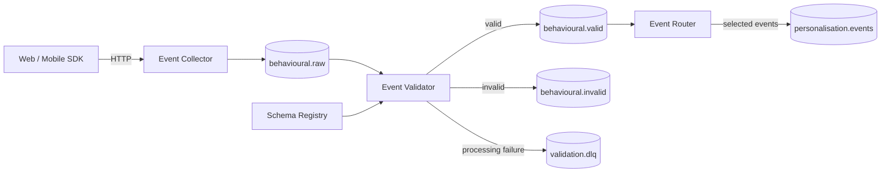

# Behavioural Event Platform — Design

## 1. Overview

The Behavioural Event Platform is a Java/Spring Boot event-processing system for ingesting, validating and routing behavioural events using Apache Kafka.

The platform receives raw behavioural events from web and mobile applications, validates them against schemas stored in Schema Registry, publishes validated events to a trusted Kafka topic, and routes selected events to a second Kafka cluster for downstream consumers.

The project demonstrates production-oriented patterns for:

- Kafka-based event ingestion
- Schema validation and evolution
- Spring Boot Kafka consumers and producers
- Multi-cluster Kafka integration
- Reliable event delivery
- Failure handling and dead-letter queues
- Observability and distributed tracing
- Integration testing with real Kafka infrastructure

---

## 2. Scope

### In scope

The platform will:

1. Accept behavioural events over HTTP.
2. Publish incoming events to a raw Kafka topic.
3. Validate events against schemas stored in Schema Registry.
4. Apply additional business validation rules.
5. Publish valid events to a trusted topic.
6. Quarantine invalid events.
7. Route selected valid events to another Kafka cluster.
8. Handle transient publishing failures.
9. Preserve event and correlation identifiers across services.
10. Provide metrics, logs and traces for the complete event lifecycle.

### Out of scope

The initial implementation will not include:

- Stream processing with Flink or Kafka Streams
- Long-term event storage
- Analytics or reporting
- User identity resolution
- Real-time feature calculation
- Kubernetes deployment
- Exactly-once processing across Kafka clusters

These can be added later if they solve a concrete requirement.

---

## 3. Example events

The platform handles behavioural events such as:

- `page_viewed`
- `product_viewed`
- `search_performed`
- `button_clicked`
- `checkout_started`
- `purchase_completed`

All events use a common envelope.

```json
{
  "eventId": "01K5R4F8W8J5Z8XJH0N6F4P2C1",
  "eventType": "product_viewed",
  "schemaVersion": 2,
  "occurredAt": "2026-09-27T01:23:31Z",
  "source": "web",
  "userId": "user-123",
  "sessionId": "session-456",
  "correlationId": "req-789",
  "payload": {
    "productId": "SKU-981",
    "category": "laptops"
  }
}
```

The envelope contains fields common to all behavioural events while `payload` is specific to the event type.

---

## 4. High-level architecture



`behavioural.raw`, `behavioural.valid`, `behavioural.invalid` and `validation.dlq` exist in Kafka Cluster A.

`personalisation.events` exists in Kafka Cluster B.

---

# 5. Core event flow

The normal processing path is:

```text
HTTP request
    ↓
Event Collector
    ↓
behavioural.raw
    ↓
Event Validator
    ↓
Schema validation
    ↓
Business validation
    ↓
behavioural.valid
    ↓
Event Router
    ↓
Routing rules
    ↓
Kafka Cluster B
```

Each service has a narrow responsibility.

The raw topic acts as the durable boundary between internet ingestion and downstream processing.

This means temporary validation or downstream failures do not require the client to resend events.

---

# 6. Event Collector

The Event Collector is an internet-facing Spring Boot service.

```text
POST /v1/events
        ↓
basic request checks
        ↓
generate metadata
        ↓
Kafka producer
        ↓
behavioural.raw
```

Its responsibility is intentionally small.

It:

- accepts events over HTTP
- assigns missing platform metadata
- propagates correlation IDs
- publishes events to Kafka
- returns an ingestion response

It does not perform full schema validation.

Validation is kept asynchronous so ingestion is not coupled to Schema Registry or downstream processing availability.

### Example response

```json
{
  "eventId": "01K5R4F8W8J5Z8XJH0N6F4P2C1",
  "status": "accepted"
}
```

HTTP `202 Accepted` indicates that the event has been accepted for asynchronous processing.

---

# 7. Event Validator

The Event Validator consumes:

```text
behavioural.raw
```

and produces:

```text
behavioural.valid
behavioural.invalid
validation.dlq
```

Validation happens in two stages.

## 7.1 Schema validation

The validator determines the expected schema using:

```text
eventType + schemaVersion
```

For example:

```text
product_viewed:v2
```

The schema is retrieved from Schema Registry.

The event payload is then validated against that schema.

Examples of schema errors include:

- missing required field
- incorrect field type
- unknown schema version
- incompatible event structure

---

## 7.2 Business validation

Schema validity does not guarantee that an event makes sense.

Additional validation rules therefore run after schema validation.

For example:

```text
eventId must be present

occurredAt must not be implausibly far in the future

product_viewed must contain productId

purchase_completed must contain orderId and amount

eventType must be supported
```

Business validation rules remain application code rather than being encoded into the schema.

---

# 8. Validation result

A validation result is represented explicitly.

```java
public record ValidationResult(
    boolean valid,
    List<ValidationError> errors
) {}
```

An error contains structured information.

```java
public record ValidationError(
    String code,
    String field,
    String message
) {}
```

Example:

```json
{
  "code": "REQUIRED_FIELD_MISSING",
  "field": "payload.productId",
  "message": "productId is required for product_viewed"
}
```

Structured errors make failures observable and testable without parsing log messages.

---

# 9. Invalid events

Invalid data is not treated as an infrastructure failure.

An invalid event is published to:

```text
behavioural.invalid
```

along with validation information.

```json
{
  "event": {
    "...": "original event"
  },
  "validationErrors": [
    {
      "code": "REQUIRED_FIELD_MISSING",
      "field": "payload.productId"
    }
  ],
  "validatedAt": "2026-09-27T01:24:02Z"
}
```

This keeps malformed producer data separate from technical processing failures.

---

# 10. Schema evolution

Schemas are versioned through Schema Registry.

For example:

### product_viewed v1

```text
productId
category
```

### product_viewed v2

```text
productId
category
recommendationSource?
```

Adding the optional field is backward compatible.

Existing v1 producers can continue publishing while newer producers use v2.

The project will include tests demonstrating:

- compatible schema evolution
- incompatible schema changes
- processing older schema versions

Schema compatibility rules are enforced by Schema Registry rather than individual services.

---

# 11. Validated events

Successfully validated events are published to:

```text
behavioural.valid
```

This topic represents the trusted event boundary.

Consumers downstream of this topic can assume that:

- the event conforms to a registered schema
- required business rules have passed
- platform metadata is present

Consumers should not need to repeat the same validation logic.

---

# 12. Event Router

Not every valid behavioural event needs to leave the primary Kafka cluster.

The Event Router consumes:

```text
behavioural.valid
```

and evaluates routing rules.

For example:

```text
product_viewed       → Cluster B
search_performed     → Cluster B
checkout_started     → Cluster B
purchase_completed   → Cluster B

page_viewed          → no route
button_clicked       → no route
```

Selected events are published to:

```text
Kafka Cluster B
    ↓
personalisation.events
```

The router therefore acts as the boundary between the behavioural event platform and the downstream personalisation platform.

---

# 13. Multi-cluster Kafka

The Event Router connects to two Kafka clusters.

```text
Kafka Cluster A
       │
       │ consume
       ▼
 Event Router
       │
       │ produce
       ▼
Kafka Cluster B
```

Separate Spring Kafka consumer and producer configurations are used.

```text
ClusterAConsumerFactory
ClusterBProducerFactory
```

Credentials, bootstrap servers and security configuration remain isolated.

This makes the cross-cluster dependency explicit rather than hiding it behind shared configuration.

---

# 14. Delivery semantics

The platform assumes at-least-once delivery.

This means consumers must tolerate duplicate events.

Every event therefore contains a globally unique:

```text
eventId
```

Downstream systems can use this identifier for deduplication when required.

The platform does not attempt distributed exactly-once delivery between Kafka clusters.

Achieving atomic consumption from Cluster A and publication to Cluster B would require coordination across independent systems and adds significant complexity.

Instead, the design favours:

```text
at-least-once delivery
+
stable event IDs
+
idempotent consumers
```

---

# 15. Retry strategy

Transient infrastructure failures should be retried.

Examples include:

- Kafka broker unavailable
- Schema Registry temporarily unavailable
- network timeout
- Cluster B temporarily unavailable

Retries use bounded exponential backoff.

```text
attempt 1
   ↓
1 second
   ↓
attempt 2
   ↓
5 seconds
   ↓
attempt 3
   ↓
30 seconds
   ↓
DLQ
```

Retries are bounded so a poison message cannot block a Kafka partition indefinitely.

---

# 16. Dead-letter queues

Technical processing failures are separated from invalid business data.

```text
behavioural.invalid
```

means:

> The event was successfully processed but failed validation.

```text
validation.dlq
```

means:

> The platform could not successfully process the event.

Examples include:

- Schema Registry unavailable after retries
- unexpected deserialization failure
- internal processing exception

The router has an equivalent DLQ for cross-cluster delivery failures.

```text
routing.dlq
```

---

# 17. Partitioning

Raw and validated behavioural events are partitioned using:

```text
userId
```

when available.

This preserves event ordering for a user.

Events without a user identifier can use:

```text
sessionId
```

as the fallback key.

The same key is preserved when the validator republishes the event.

This means events for the same user remain ordered through the validation pipeline within the limits of Kafka partition ordering.

---

# 18. Observability

Each service exposes Spring Boot Actuator and Micrometer metrics.

Important metrics include:

```text
events_received_total

events_validated_total

events_invalid_total

validation_latency

schema_registry_errors_total

kafka_publish_errors_total

routing_events_total

routing_failures_total

consumer_lag
```

Logs are structured JSON.

Every log entry includes where available:

```text
eventId
correlationId
eventType
service
topic
partition
offset
```

OpenTelemetry propagates tracing information across HTTP and Kafka boundaries.

A trace can therefore show:

```text
HTTP request
   ↓
Event Collector
   ↓
Kafka
   ↓
Event Validator
   ↓
Kafka
   ↓
Event Router
   ↓
Kafka Cluster B
```

---

# 19. Security boundaries

The Event Collector is the only internet-facing service.

Internal services are not directly exposed externally.

Kafka credentials follow least privilege.

For example:

```text
event-collector
    WRITE behavioural.raw

event-validator
    READ  behavioural.raw
    WRITE behavioural.valid
    WRITE behavioural.invalid
    WRITE validation.dlq

event-router
    READ  behavioural.valid
    WRITE personalisation.events
    WRITE routing.dlq
```

Cluster A and Cluster B use separate credentials.

Secrets are supplied through environment configuration and are never stored in source control.

---

# 20. Failure scenarios

| Failure | Behaviour |
|---|---|
| Invalid event schema | Publish to `behavioural.invalid` |
| Business validation failure | Publish to `behavioural.invalid` |
| Schema Registry unavailable | Retry, then DLQ |
| Validator unavailable | Events remain in `behavioural.raw` |
| Cluster B unavailable | Router retries, then DLQ |
| Duplicate Kafka delivery | Same `eventId` preserved |
| Unknown event type | Publish to `behavioural.invalid` |
| Unexpected processing error | Publish to DLQ |

A service failure should not result in silent event loss.

---

# 21. Testing strategy

The project favours integration testing over mocking Kafka behaviour.

Testcontainers provides:

```text
Kafka Cluster A
Kafka Cluster B
Schema Registry
```

Integration tests exercise complete flows.

### Valid event

```text
HTTP
 → behavioural.raw
 → validator
 → behavioural.valid
```

### Invalid event

```text
HTTP
 → behavioural.raw
 → validator
 → behavioural.invalid
```

### Routed event

```text
HTTP
 → Cluster A
 → validation
 → behavioural.valid
 → router
 → Cluster B
 → personalisation.events
```

### Schema evolution

Tests register multiple schema versions and verify compatible events continue to process successfully.

Unit tests remain focused on deterministic business validation and routing rules.

---

# 22. Local development

Docker Compose provides the complete local infrastructure.

```text
Kafka Cluster A
Kafka Cluster B
Schema Registry
```

Applications run either locally through Spring Boot or as containers.

A developer should be able to start the infrastructure with:

```bash
docker compose up -d
```

and run the services independently.

---

# 23. Repository structure

```text
behavioural-event-platform/
│
├── event-collector/
│   └── src/
│
├── event-validator/
│   └── src/
│
├── event-router/
│   └── src/
│
├── event-contracts/
│   ├── schemas/
│   └── src/
│
├── integration-tests/
│
├── infrastructure/
│   └── docker/
│
├── docs/
│   ├── Design.md
│   └── decisions/
│
├── docker-compose.yml
├── README.md
├── settings.gradle.kts
├── gradle/
│   └── libs.versions.toml
└── gradlew
```

`event-contracts` contains shared event-envelope definitions and schemas.

Service-specific business logic remains within the owning service.

---

# 24. Architecture decisions

Important decisions should be documented separately as ADRs.

Initial ADRs:

```text
0001-use-kafka-as-durable-ingestion-boundary.md

0002-validate-events-asynchronously.md

0003-separate-schema-and-business-validation.md

0004-use-at-least-once-delivery.md

0005-use-event-id-for-idempotency.md

0006-separate-invalid-events-from-processing-dlq.md

0007-use-separate-kafka-configurations-per-cluster.md

0008-preserve-user-ordering-with-partition-keys.md
```

Each ADR should document:

- decision
- context
- how it works
- alternatives considered
- consequences and trade-offs

---

# 25. Build roadmap

## Phase 1 — Basic ingestion

Build:

```text
HTTP
 → Event Collector
 → behavioural.raw
```

Add Docker Compose and integration tests.

---

## Phase 2 — Schema validation

Introduce:

```text
Schema Registry

behavioural.raw
 → Event Validator
 → behavioural.valid
```

Demonstrate schema registration and compatibility.

---

## Phase 3 — Invalid event handling

Add:

```text
behavioural.invalid
validation.dlq
```

Introduce structured validation errors and retry behaviour.

---

## Phase 4 — Cross-cluster routing

Introduce Kafka Cluster B.

Build:

```text
behavioural.valid
 → Event Router
 → personalisation.events
```

Add multi-cluster integration tests.

---

## Phase 5 — Reliability

Add:

- retry policies
- idempotent producers
- stable event IDs
- DLQ handling
- failure injection tests

---

## Phase 6 — Observability

Add:

- Micrometer metrics
- consumer lag monitoring
- structured logging
- OpenTelemetry tracing

Demonstrate the complete event lifecycle through traces and metrics.

---

# 26. Key design principles

### Keep ingestion simple

Internet ingestion should not depend on downstream validation or processing availability.

### Raw events are immutable

The raw topic represents what the producer actually sent.

### Validation creates a trust boundary

Consumers of `behavioural.valid` should not need to implement the same validation again.

### Separate bad data from broken infrastructure

Invalid events and technical processing failures have different operational meanings and therefore different destinations.

### Prefer at-least-once delivery over distributed coordination

Stable event identifiers and idempotent processing provide simpler and more realistic reliability than attempting distributed exactly-once semantics across Kafka clusters.

### Make failure visible

No event should silently disappear because a dependency was unavailable.

### Keep services focused

Each service owns one clear responsibility:

```text
Collector → ingest

Validator → establish trust

Router → distribute
```

Additional services should only be introduced when a concrete responsibility requires them.